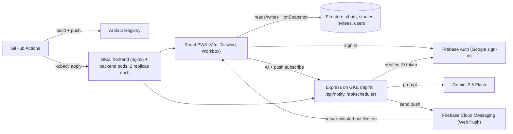

# Campus Ministry PWA — Final Project Plan

## 1. Product summary

A "GroupMe for campus ministry" focused on the one workflow GroupMe is bad at: scheduling bible studies through the 8-step curriculum (`Seeking God → Word of God → Discipleship → Kingdom → Light and Darkness → Cross → Church → CTC`) and giving leaders campus-wide visibility.

**Personas / roles**
- Member: in one bible talk on one campus. Sees their bible talk's chat and all studies in their bible talk.
- Bible-talk leader: member + sees all studies across every bible talk on their campus.
- Ministry leader ("special user"): sees all studies across all campuses.

## 2. Domain model (Firestore collections)

```
campuses/{campusId}                       # { name }
bibleTalks/{bibleTalkId}                  # { campusId, name, gender: "M"|"F", memberIds[] }
users/{uid}                               # { email, displayName, photoURL, gender, role, campusId, bibleTalkId, fcmTokens[] }
invitees/{inviteeId}                      # { name, gender, bibleTalkId, campusId, currentStudyIndex (0-7) }
studies/{studyId}                         # { bibleTalkId, campusId, inviteeId, inviteeName, gender, studyName, studyIndex, scheduledAt, durationMinutes, location, leadUid, supportUids[], status: "scheduled"|"completed"|"cancelled" }
messages/{bibleTalkId}/items/{messageId}  # { authorUid, authorName, text, createdAt }
```

Firestore security rules enforce role-based reads (member: own BT only; BT leader: own campus; ministry leader: all).

## 3. Architecture



Real-time chat and calendar use Firestore `onSnapshot` listeners (server-initiated updates without WebSockets). FCM Web Push covers PWA notifications when the app is closed.

## 4. Proposed repository structure

```
/frontend          React + Vite + TS + Tailwind PWA
  src/
    pages/         Login, Onboarding, BibleTalkChat, Studies, InviteeProfile, Calendar, Dashboard, AskBot, Settings
    components/    StudyCard, StudyForm, WeeklyCalendar (drag+drop), WeeklyHeatmapCanvas, AskBotPanel, ConsentBanner, OfflineBanner
    lib/           firebase.ts, api.ts, push.ts, offlineQueue.ts, canvasDraw.ts
    hooks/         useAuth, useRole, useStudies, useChat, useStudiesThisWeek
  vite.config.ts   # VitePWA plugin + Workbox
  Dockerfile       # multi-stage: build -> nginx
/backend           Node + Express + TS
  src/
    routes/        ai.ts (Gemini: /next-study, /ask), notify.ts (FCM), scheduler.ts (study reminders cron)
    middleware/    verifyFirebaseToken.ts, helmet, rate-limit
    services/      gemini.ts (function-calling tools: listStudies, countStudies, listInvitees), fcm.ts, firestore.ts
  Dockerfile
/k8s
  frontend-deployment.yaml   # replicas: 2, e2-micro friendly resources
  backend-deployment.yaml    # replicas: 2
  *-service.yaml, ingress.yaml (Google-managed cert), hpa.yaml (optional)
  firestore-rules.rules
/.github/workflows
  ci.yml           # lint + typecheck + tests on PR
  deploy.yml       # build images -> Artifact Registry -> deploy to GKE on main
/docs              ARCHITECTURE.md, REQUIREMENTS.md, DATABASE.md, screenshots/
/logs              two successful GitHub Actions run logs (for the F deadline deliverable)
README.md
```

## 5. Spec-to-implementation map

- **Semantic HTML5**: `<header>` app bar, `<nav>` BT list, `<main>` active view, `<article>` per message/study card, `<time>` for timestamps, `<aside>` for invitee progress panel.
- **Two interactive APIs (must pick 2)**:
  - **Drag and Drop** — `WeeklyCalendar` lets you drag a study card to a new day/hour (Google-Calendar-style); updates `studies/{id}.scheduledAt`. Lead/Supports are edited inline in the event-details form, not via drag-and-drop.
  - **HTML5 Canvas 2D** — `WeeklyHeatmapCanvas` on the dashboard hand-draws a 7×14 (days × hours) grid where cell **hue** shifts from cool teal (morning) → warm amber → deep red (evening), cell **fill intensity** scales with study count, and inline `M`/`F` glyphs show gender breakdown. Listens to Firestore for live redraw. Hover/tap shows tooltips. (The originally-considered second canvas `CurriculumFunnelCanvas` is **dropped** to keep solo scope tight; the heatmap alone fully satisfies the "Canvas API used meaningfully" rubric.)
- **Responsive 320/768/1024**: Tailwind responsive prefixes; 3-pane desktop layout collapses to bottom-tab nav on mobile (Chat / Studies / Calendar / Me).
- **CSS**: Tailwind exclusively.
- **SPA**: React Router, no full reloads.
- **Frontend framework**: React.
- **Backend framework**: Express.
- **Accessibility**: focus management on view changes, ARIA live region for new chat messages, `aria-label` on icon buttons, keyboard-reachable drag-and-drop fallback (arrow-key reschedule via context menu), visually-hidden `<table>` mirror of the canvas heatmap data for screen readers, Tailwind contrast-safe palette.
- **PWA offline + installable**: Vite PWA plugin generates manifest + service worker; offline shell shows skeletons + "Reconnecting..." banner.
- **Offline queueing**: outgoing chat messages and study edits go through `offlineQueue.ts` (IndexedDB via `idb-keyval`) and flush on `online` event — exactly the "queued database inserts" example in the spec.
- **Server-initiated notifications**: FCM Web Push is the qualifying mechanism. Backend `/api/scheduler/tick` runs on a `setInterval` in the backend pod (idempotent — uses a `studies/{id}.reminderSent` flag so duplicate ticks don't double-fire) and pushes reminders 15 min before each scheduled study. A second admin-only endpoint `POST /api/notify/test` exists purely so the demo can visibly trigger a server push on camera. (Firestore `onSnapshot` provides push-style chat updates, but Web Push via FCM is what we cite for the rubric since it works with the app closed.)
- **HTTPS**: GKE Ingress with Google-managed certificate on the instructor-provided domain.
- **Auth**: Firebase Auth Google sign-in (satisfies hashing-by-proxy clause). Frontend sends the Firebase ID token in the `Authorization: Bearer …` header; backend verifies it via Admin SDK on every `/api/*` call. No auth cookies are issued by our backend.
- **Security**: Helmet, Zod-validated request bodies on every `/api` route, `express-rate-limit` on `/api`, CORS allowlist, Firestore security rules (no direct DB queries from client without role check), React auto-escapes XSS, `dangerouslySetInnerHTML` banned by ESLint rule. **CSRF**: because the API is bearer-token-authenticated (not cookie-authenticated) and there is no ambient credential a cross-site form could ride, classic CSRF does not apply — REQUIREMENTS.md will state this explicitly rather than fabricate a CSRF mitigation. A small first-load consent/permissions banner explains auth storage and notification-permission requests. Secrets live in GitHub Actions secrets + Kubernetes Secrets, never in the repo (`.env.example` only).
- **Database**: Firestore via official SDK (counts as the required ODM). Justification in `REQUIREMENTS.md`: real-time chat, generous free tier, native integration with Firebase Auth and FCM, multi-tenant security rules.
- **AI**: Gemini 2.5 Flash, two complementary features both behind `/api/ai/*` (Firebase ID-token-gated, rate-limited):
  1. `/api/ai/next-study` — input `{ inviteeId }`. Backend reads the invitee's `currentStudyIndex`, looks up the next study in the curriculum, and asks Gemini to write a short, warm follow-up message (1–2 sentences) the leader can paste into chat. Returns `{ nextStudyName, suggestedMessage }`. Surfaced on the invitee profile and as a "needs follow-up" dashboard list.
  2. `/api/ai/ask` — input `{ question }`. Uses Gemini function-calling with three typed tools that wrap Firestore queries: `listStudies({ studyName?, weekOf?, campusId?, bibleTalkId?, gender?, status? })`, `countStudies(sameFilters)`, `listInvitees({ campusId?, bibleTalkId?, completedStudy? })`. Backend always injects the caller's role-scoped filters before executing — Gemini cannot widen visibility. Gemini formats the natural-language answer. Handles questions like "How many Light and Darkness studies this week and what are their names?" or "Which bible talks haven't scheduled any studies this week?"
- **GKE**: 2 e2-micro nodes, two Deployments each with `replicas: 2`, shared Ingress. Demo: `kubectl delete pod` then `kubectl get pods -w`; `kubectl scale deploy/backend --replicas=4`; `kubectl get ingress` shows the LB IP that serves the app.
- **CI/CD**: Two GitHub Actions workflows. `ci.yml` (PR/push): install → lint → typecheck → vitest (frontend + backend) → Firestore rules tests. `deploy.yml` (main): same checks → `docker/build-push-action` to Artifact Registry (commit-SHA tag) → `google-github-actions/auth` (Workload Identity Federation, no JSON keys) → `get-gke-credentials` → `kubectl apply -f k8s/` → `kubectl rollout status`. Run logs visibly show **build / test / deploy** as three distinct stages — two successful logs saved into `/logs/`.

## 6. UI surface (5 main views)

1. **Bible Talk Chat** — group chat for the user's bible talk; Firestore-backed; ARIA live region.
2. **Studies** — list of studies the user is allowed to see (role-filtered), grouped by Men/Women, with a "Mark complete" action that bumps the invitee's `currentStudyIndex` and surfaces the AI "next study" suggestion.
3. **Invitee Profile** — per-invitee timeline of completed studies, current curriculum stage, and an "AI: Suggest next study + draft follow-up" button.
4. **Weekly Calendar** — Mon–Sun × hourly grid; Google-Calendar-style drag-and-drop reschedule; gender + bible-talk color coding; click event to edit details (study name, location, Lead, Supports); ministry-leader view aggregates across campuses with filters.
5. **Dashboard** — counts per bible talk, per campus, per study type; the **Canvas Weekly Heatmap** as centerpiece; "Needs follow-up" list (AI); and an **"Ask MinistryBot"** input box (free-form natural-language Q&A). For ministry leaders only, a "Send test push now" button (server-initiated notification demo trigger).

## 7. Known risks + mitigations

- **First-time GKE**: cluster + Ingress + managed cert can eat a day. Mitigation: as the very first work item, create the cluster and deploy a "hello world" pod end-to-end via Actions **before any feature code is written** — surface infra problems early.
- **Firestore security rules complexity** (3-tier role visibility): write rule unit tests with `@firebase/rules-unit-testing` early.
- **FCM Web Push on iOS**: only works when installed as PWA (iOS 16.4+); document this.
- **e2-micro RAM**: nginx + node may bump up against limits with two pods each. Mitigation: set tight `resources.requests`; if pods get evicted, upgrade to e2-small (spec allows with notification).

## 8. Decisions (previously open items — finalized so we can execute)

- **Curriculum**: 8 studies, in this order, stored as `CURRICULUM = ["Seeking God", "Word of God", "Discipleship", "Kingdom", "Light and Darkness", "Cross", "Church", "CTC"]` in `frontend/src/lib/curriculum.ts` (re-exported on backend). "Church" and "CTC" are two separate studies. Easy to edit later if the ministry uses different names — single source of truth.
- **Invitees**: stored as plain Firestore records (`invitees/{inviteeId}`), not app users. They have a `linkedUserId?: string` field reserved for the future case where an invitee becomes a ministry member with their own login.
- **Domain / HTTPS**: use the **instructor-provided** domain. Plan assumes a single hostname, GKE Ingress with a Google-managed certificate, and frontend served via nginx behind that ingress.
- **Second canvas**: **dropped**. The Weekly Heatmap alone fully satisfies the Canvas-API rubric and keeps solo scope realistic.

## 9. Definition of done (sanity-check before recording the demo)

> Note: even though we're not pacing by the spec's recommended schedule, the Wed Jun 10 (code + demo, 70 pts) and Fri Jun 12 (docs + logs, 30 pts) Gradescope cutoffs are still hard. Hit Definition of Done before Jun 10 and the rest is just paperwork.

- `npm run lint && npm run typecheck && npm test` is green for both `/frontend` and `/backend`.
- A push to `main` triggers GitHub Actions → builds + tests + deploys → `kubectl rollout status` succeeds; the run log clearly shows three stages.
- `kubectl get deploy` shows both Deployments at `2/2 Ready`. `kubectl get ingress` returns an external IP, opening it loads the app over HTTPS.
- Lighthouse PWA audit passes: installable, offline shell loads, manifest valid.
- Killing a pod with `kubectl delete pod` results in a new pod within ~30s. `kubectl scale deploy/backend --replicas=4` scales up; back to 2 scales down.
- Sign in with Google works; refreshing keeps you signed in; signing out clears state.
- Posting a chat message offline queues it, and on reconnect it appears in Firestore.
- Hitting "Send test push now" from a ministry-leader account delivers a notification to a different signed-in browser within seconds.
- `/api/ai/next-study` returns `{ nextStudyName, suggestedMessage }` for a known invitee. `/api/ai/ask` correctly answers "How many Light and Darkness studies this week?" using only data the caller is allowed to see.
- Repo root contains README.md, ARCHITECTURE.md, REQUIREMENTS.md, DATABASE.md, /logs with two successful runs, /k8s manifests, Dockerfiles for both apps, and zero secrets.