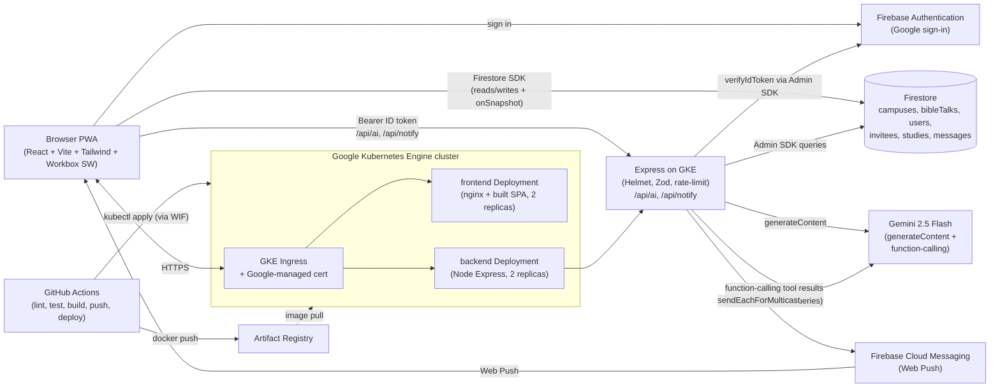
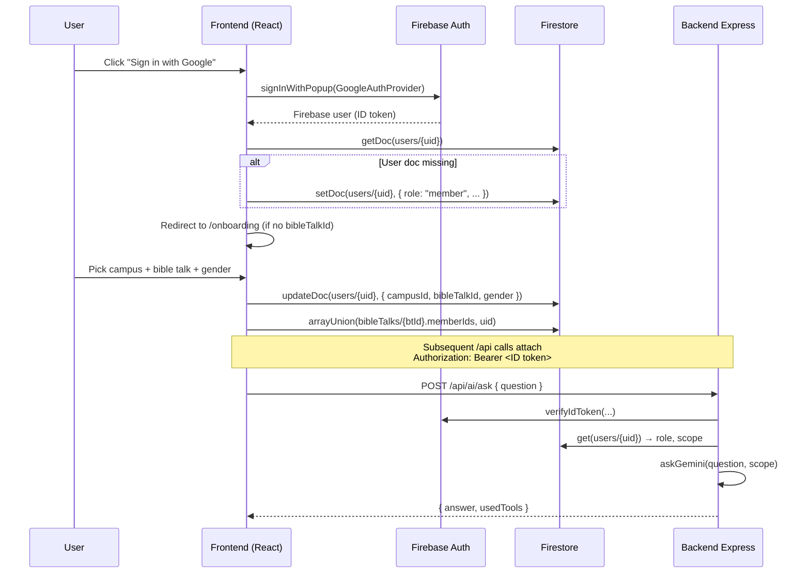
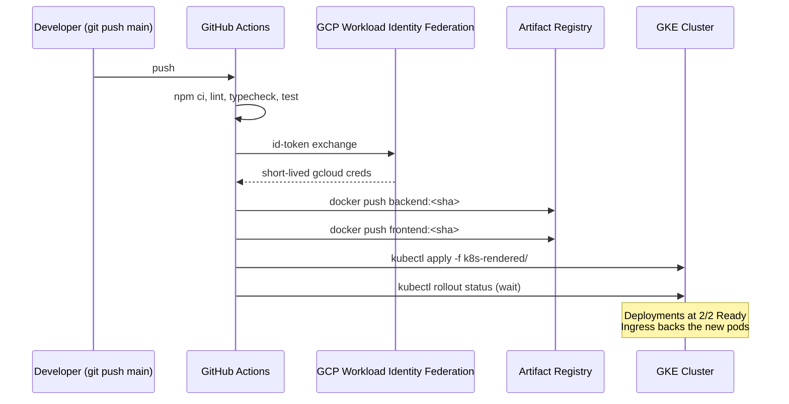

# Architecture

## High-level diagram

## Components

### Frontend (`/frontend`)

A single-page React app served by nginx. Highlights:

- **Routing** — `react-router-dom`. Auth-aware route guard in [`src/App.tsx`](../frontend/src/App.tsx) redirects unsigned-in users to `/login` and partly-onboarded users to `/onboarding`.
- **Data** — Firestore Web SDK with persistent IndexedDB cache. Real-time `onSnapshot` listeners power chat, studies, calendar, dashboard, and invitee timelines.
- **Offline queue** — [`src/lib/offlineQueue.ts`](../frontend/src/lib/offlineQueue.ts) wraps `idb-keyval`. When `navigator.onLine === false`, chat messages and study edits are queued; an `online` event handler flushes them via [`queueProcessor.ts`](../frontend/src/lib/queueProcessor.ts).
- **Canvas heatmap** — [`src/components/WeeklyHeatmapCanvas.tsx`](../frontend/src/components/WeeklyHeatmapCanvas.tsx) hand-draws a 7-day × 14-hour grid on a `<canvas>` with HSL fills (hue interpolated by time of day, saturation by study count) and pointer-hit-test tooltips. A `<table class="sr-only-table">` mirror exposes the same data to screen readers.
- **Drag and drop** — [`src/components/WeeklyCalendar.tsx`](../frontend/src/components/WeeklyCalendar.tsx) uses native HTML5 D&D APIs (`onDragStart`, `onDrop`, `dataTransfer`). Each cell is a drop target; dropping a study writes a new `scheduledAt` to Firestore. Keyboard fallback: Shift + arrow keys.
- **PWA** — `vite-plugin-pwa` with `injectManifest` strategy. The service worker [`src/sw.ts`](../frontend/src/sw.ts) precaches the build manifest, runtime-caches images and static assets, falls back to the SPA shell on navigations, and renders Web Push notifications.

### Backend (`/backend`)

A small Express app. Every `/api/*` route is gated by [`verifyFirebaseToken`](../backend/src/middleware/verifyFirebaseToken.ts), which verifies the `Authorization: Bearer …` Firebase ID token and loads the caller's `users/{uid}` doc so handlers know the role-scope.

Routes:

- `POST /api/ai/next-study` — given an `inviteeId`, returns the next study in the curriculum and a Gemini-drafted follow-up message ([`routes/ai.ts`](../backend/src/routes/ai.ts)).
- `POST /api/ai/ask` — natural-language Q&A. Uses Gemini function-calling with tools defined in [`services/firestoreTools.ts`](../backend/src/services/firestoreTools.ts) (`listStudies`, `countStudies`, `listInvitees`). The backend force-injects role-scoped filters into every tool invocation, so Gemini cannot widen visibility.
- `POST /api/notify/register` — store the caller's FCM Web Push token on `users/{uid}.fcmTokens` via `FieldValue.arrayUnion`.
- `POST /api/notify/test` — ministry-leader only; broadcasts a test push to every registered device. Used in the recorded demo.

Background:

- [`services/scheduler.ts`](../backend/src/services/scheduler.ts) runs in-process. Every minute it scans for studies starting within the next 15 minutes and pushes a reminder to the lead and supports. Idempotent via `studies/{id}.reminderSent`.

### Data (`Firestore`)

See [`DATABASE.md`](DATABASE.md) for the full collection-by-collection breakdown.

### Auth flow

### Deployment flow

## Why this stack

- **Firestore over Postgres**: real-time chat and calendar are first-class with `onSnapshot`. The free tier comfortably covers the demo. Multi-tenant role scoping is enforceable in declarative security rules, which are unit-testable.
- **Express over Next.js / Hono**: a thin, dedicated API layer keeps the AI proxy, FCM senders, and reminder scheduler off the client and out of the page-render path. The frontend stays as a pure static SPA, which makes the GKE deployment story two simple Deployments instead of one fragile SSR server.
- **GKE over Cloud Run**: spec mandates GKE specifically (must show self-healing + manual scaling). Two e2-micro nodes with 2 replicas per Deployment meets the spec minimums and fits comfortably inside the education credit.
- **Gemini 2.5 Flash function-calling over a vector DB**: the data is small and highly structured. Function-calling lets Gemini ask for exactly what it needs and lets us enforce role-scoped filters before any query runs — safer and simpler than embeddings.

## Failure modes & mitigations

| Failure                                  | Mitigation                                                             |
| ---------------------------------------- | ---------------------------------------------------------------------- |
| Pod dies                                 | Deployment `replicas: 2` + Kubernetes self-heal; readiness/liveness probes route around bad pods |
| Browser goes offline                     | Service worker serves SPA shell; outgoing writes queue in IndexedDB and flush on `online` |
| Scheduler double-fires across replicas   | `studies/{id}.reminderSent` atomic flip — first replica wins           |
| Gemini outage                            | `/api/ai/*` returns 500 with friendly UI banner; other features unaffected |
| FCM token invalidated                    | `arrayUnion` always re-adds the current token; demo also has manual "Send test push" button |
| Firestore rules misconfigured            | `@firebase/rules-unit-testing` suite covers the three role tiers       |
| Secrets in repo                          | Banned via `.gitignore` + GitHub Actions secrets + Kubernetes Secrets + `.env.example` only |
